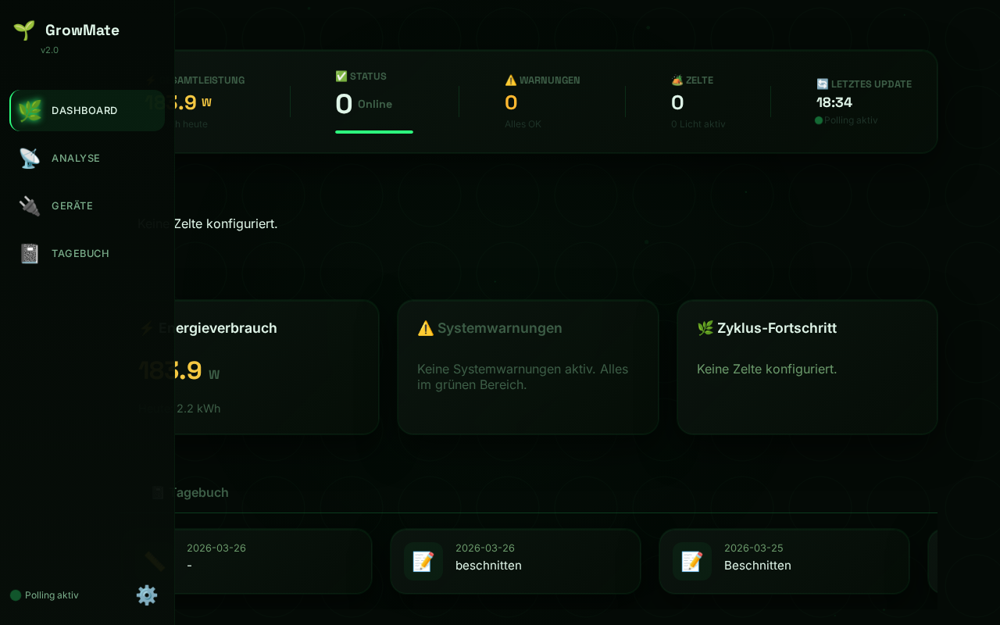
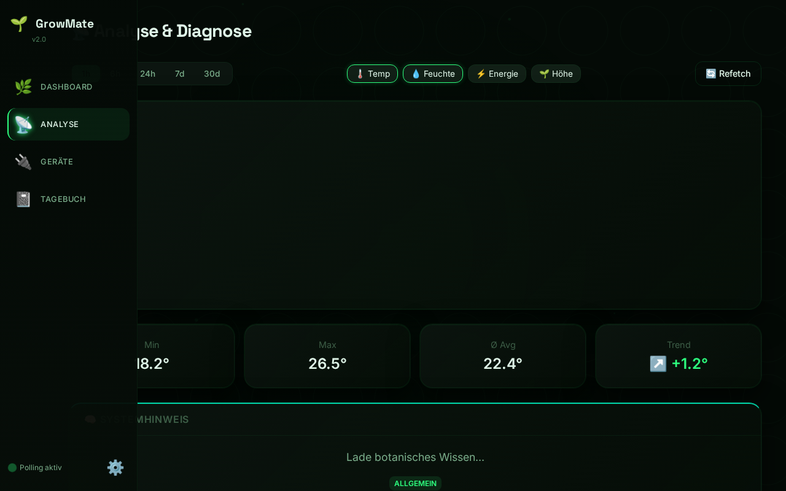
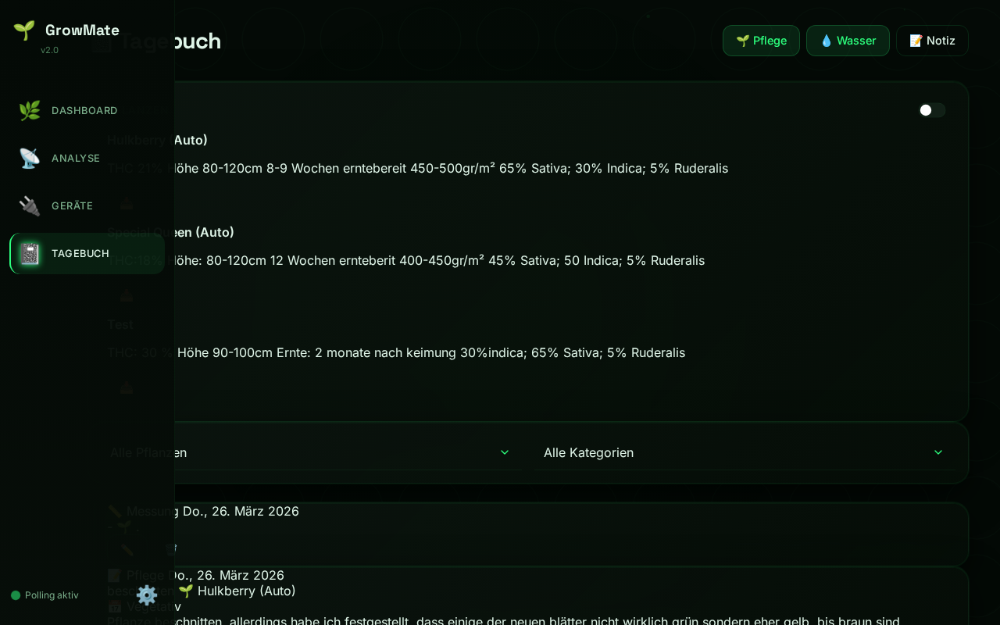
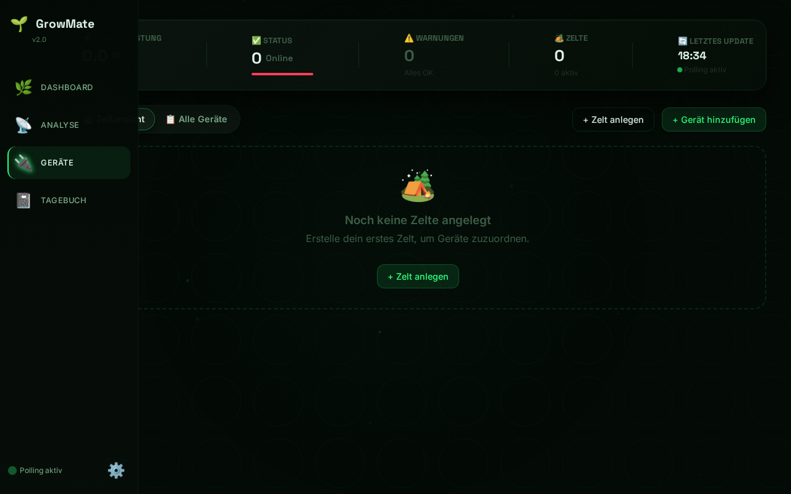

<div align="center">
  

  # 🌱 GrowMate v2.1.2
  *Autarkes Botanik-Monitoring & Edge-AI System*

  [](https://opensource.org/licenses/MIT)
  [](#)
  [](#)
  [](#)
</div>

<br />

GrowMate ist ein Local-First-System zur iterativen Überwachung und Automation von Pflanzenumgebungen. Es wurde mit einem kompromisslosen Fokus auf **maximale Datensicherheit und Unabhängigkeit** entwickelt. Anstatt private Umgebungs- und Telemetriedaten an undurchsichtige Cloud-Infrastrukturen zu senden, behält GrowMate alle Informationen lokal.

---

## 📸 Projekt-Screenshots (Live Applikation)

<table align="center">
  <tr>
    <td align="center">
      <b>Dashboard (Real-Time Metriken)</b><br>
      
    </td>
    <td align="center">
      <b>Analyse (VPD & Klima-Visualisierung)</b><br>
      
    </td>
  </tr>
  <tr>
    <td align="center">
      <b>Tagebuch (Ereignis-Tracking)</b><br>
      
    </td>
    <td align="center">
      <b>Geräteverwaltung (Sensoren)</b><br>
      
    </td>
  </tr>
</table>

---

## ✨ Features

*   🧠 **Lokale Edge-AI (RAG):** Nutzt eine leichtgewichtige, token-effiziente ONNX-Vektordatenbank, um anhand pflanzenspezifischer Parameter dynamische Warnungen auszugeben (z. B. Hitzestress, Luftfeuchtigkeit). Vollständig offline – kein OpenAI-Key zur Laufzeit nötig!
*   🔒 **Radikale Autarkie (Local-First):** Verwendet *Bluetooth Low Energy* für passive Govee-Klimasensoren und die lokale Netzwerk-API (`PyP100`) für Tapo-Hubs und -Steckdosen. Null Hersteller-Cloud-Zwang!
*   🔬 **Wissenschaftliches Monitoring:** Berechnet im Hintergrund hochpräzise agrarwissenschaftliche Werte wie das Vapor Pressure Deficit (**VPD**) und die notwendige Beleuchtungsstärke.
*   🛡️ **Sichere Architektur:** Konsequente Trennung von Logic und Credentials via `.env`. Die lokale Telemetrie-Datenbank läuft auf einer gehärteten SQLite-Instanz (WAL-Modus) für extrem robuste I/O-Prozesse (ideal für SD-Karten/Edge Devices).

---

<details>
<summary><b>🛠️ Systemanforderungen & Kompatibilität (Jetzt ausklappen)</b></summary>
<br>
Dank des strikt modularen Aufbaus in Python und Flask läuft GrowMate plattformunabhängig und ressourcenschonend:

*   🐧 **Linux Edge-Devices:** Raspberry Pi, Kubuntu, Debian.
*   🪟 **Windows Server:** Kompatibel mit traditionellem x64 sowie modernem **Windows 11 ARM64** (z.B. Snapdragon Prozessoren).
*   👻 **Hintergrund-Betrieb (Headless):** Unterstützt den vollkommen unsichtbaren Headless-Betrieb via `.vbs` oder PowerShell `WMI Win32_Process`-Injektion.

</details>

<details>
<summary><b>🚀 Installation & Setup Anleitung (Jetzt ausklappen)</b></summary>
<br>

### 1. Repository Klonen
```bash
git clone -b growmate-v2.1.2 https://github.com/gogogadget1/growmate.git
cd growmate
```

### 2. Virtuelle Umgebung einrichten
Wir empfehlen strikt die Nutzung einer virtuellen Umgebung, um Abhängigkeiten des Systems isoliert zu halten.
```bash
# Unter Linux/macOS:
python3 -m venv venv
source venv/bin/activate

# Unter Windows (PowerShell):
python -m venv venv
.\venv\Scripts\Activate.ps1
```

### 3. Abhängigkeiten installieren
```bash
pip install -r requirements.txt
```

### 4. Konfiguration (Datensicherheit)
Die Zugangsdaten für Netzwerkgeräte (wie Tapo) werden **niemals** in die `config.json` geschrieben, sondern verschlüsselt durch Umgebungsvariablen gesichert:

1.  Kopieren Sie die Vorlagendatei: `cp .env.example .env`
2.  Öffnen Sie die `.env` und tragen Sie Ihre Anmeldedaten ein.
3.  Die `config.json` steuert lediglich die Topologie der Sensoren und das Timer-Intervall.

</details>

---

## 🖥 Bedienung

Starten Sie die Applikation einfach über den Haupteinstiegspunkt:
```bash
python app.py
```
Sobald der Server hochgefahren ist, rufen Sie das Web-Dashboard lokal im Browser auf:
👉 **http://127.0.0.1:5000** oder die Host-IP Ihres dedizierten Servers.

*(Architektur-Empfehlung: Um GrowMate vor Verbindungsabbrüchen zu schützen, empfehlen wir, die Applikation über die Windows Aufgabenplanung oder autarke WMI-Skripte als Hintergrunddienst zu verankern.)*
