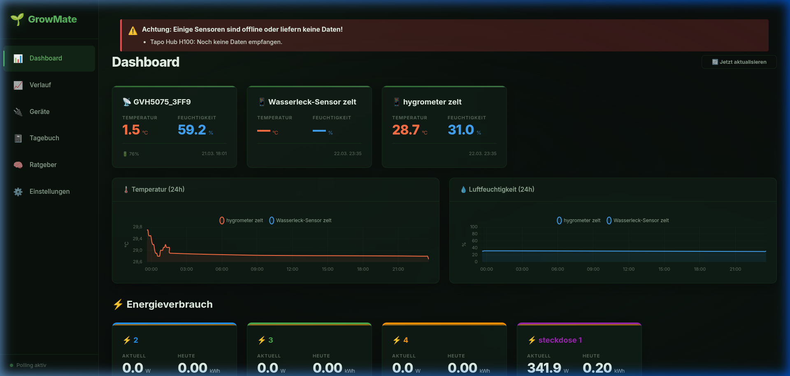
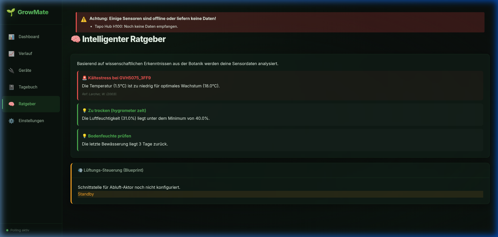

# 🌿 GrowMate – Professional Grow Monitor & Advisor

GrowMate ist ein autarkes, privatsphäre-fokussiertes Softwaresystem zur Überwachung, Steuerung und wissenschaftlichen Dokumentation der Pflanzenzucht. Entwickelt für den Betrieb auf lokaler Hardware (Raspberry Pi, Laptops), verzichtet es bewusst auf Cloud-Abhängigkeiten und bietet dennoch modernste Features.

---

## ✨ Highlights

*   **🧠 Botany AI Advisor**: Integriertes botanisches Wissen analysiert Sensordaten in Echtzeit und gibt präzise Pflegehinweise (VPD, Hitzestress, Schimmelwarnung).
*   **💎 Premium Glassmorphism UI**: Ein hochmodernes, visuell ansprechendes Interface mit Dark Mode und flüssigen Animationen.
*   **🛡️ Safety First**: Mehrstufige Bestätigungsdialoge schützen vor versehentlichem Löschen wichtiger Daten oder Geräte.
*   **🔌 IoT Integration**: Volle Unterstützung für Govee BLE Sensoren und Tapo Smart Plugs.
*   **🏠 Local-First & Zero-Root**: Deine Daten gehören dir. Das System läuft nativ auf deinem Host ohne Docker-Zwang oder Root-Rechte.

---

## 🖼️ Impressionen


*Modernes Dashboard mit Echtzeit-Metriken & Glassmorphism-Ästhetik*


*Wissenschaftlicher Ratgeber basierend auf botanischen Phasen*

---

## 🚀 Schnelleinstieg

### 1. Installation
Stelle sicher, dass Python 3.10+ installiert ist. Installiere dann die Abhängigkeiten:

```bash
pip install -r requirements.txt
```

### 2. Datenbank-Setup
Initialisiere die wissenschaftliche Wissensbasis mit Standard-Parametern:

```bash
python3 setup_knowledge_db.py
```

### 3. Konfiguration
Kopiere die Beispiel-Konfiguration und passe sie an:

```bash
cp config.json.example config.json
```

Erstelle eine `.env` Datei im Hauptverzeichnis für deine Zugangsdaten:

```env
TAPO_EMAIL=deine@email.de
TAPO_PASSWORD=dein_passwort
PLANT_EDIT_PASSWORD=growmate  # Passwort für kritische Änderungen
```

### 4. Starten
Nutze das mitgelieferte Watchdog-Skript für maximale Stabilität:

```bash
./start.sh
```
Die App ist anschließend unter **http://localhost:5000** erreichbar.

---

## 🛠️ Technologie-Stack
- **Backend**: Flask (Python), APScheduler
- **DB**: SQLite (Local-First)
- **Frontend**: Vanilla JS (ES6+), Modern CSS (Custom Glassmorphism)
- **Kommunikation**: Bleak (Bluetooth LE), Tapo PyP100

---
*Viel Erfolg bei deinem Grow!*
