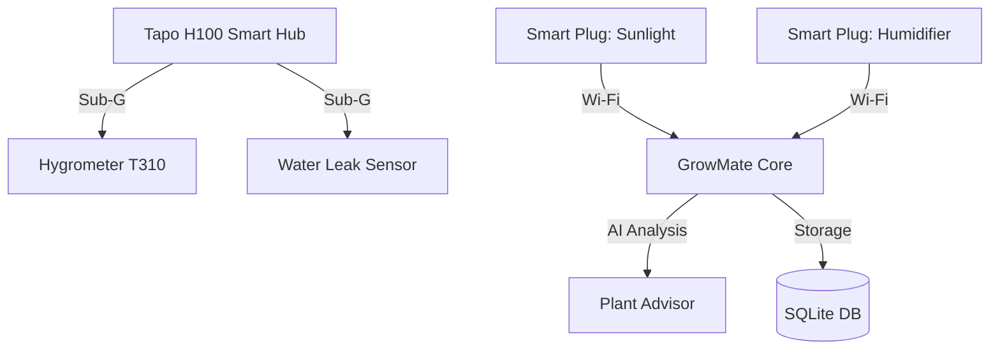

# GrowMate: The Art of Intelligent Growing

Welcome to the future of botanical precision. GrowMate combines state-of-the-art sensor technology with AI-driven analytics to ensure your plants thrive in the perfect environment.

---

## 🏗 System Architecture Overview

GrowMate works as a decentralized intelligence network, connecting physical hardware to a central advisor.

---

## ⚡️ Quick Start: Get Growing!

1. **Power up your Server:** The production environment starts automatically on boot.
2. **Manual Start:** If needed, login via SSH and run `.\gm_control.ps1 start`.
3. **Access the Dashboard:** Open your browser and navigate to `http://192.168.178.97:5000`.
4. **Monitor:** Watch your plants thrive with real-time data!

---

## 📱 The Dashboard

The Dashboard is your command center. It provides real-time insights into your grow space.

- **Environmental Metrics:** Temperature and humidity tracking with high-precision charts.
- **Device Grid:** Monitor the status of every plug, hub, and sensor at a glance.
- **Tent Management:** Organized views for multiple grow tents (e.g., "Zelt 1", "Mutterbox").

### 🧪 Advanced Science (VPD & DLI)
GrowMate automatically calculates the **Vapor Pressure Deficit (VPD)** and **Daily Light Integral (DLI)** to provide professional-grade insights into plant transpiration and photosynthesis efficiency.

---

## 🤖 The Living Advisor

Our AI Advisor isn't just a bot—it's a digital botanist. It analyzes your sensor data every minute to provide actionable tips.

> [!TIP]
> **Example Advice:** "Your humidity dropped to 44% during the late flowering stage. This is excellent for preventing bud rot, but ensure your VPD stays between 1.2 and 1.5 kPa for optimal nutrient uptake."

---

## 🔌 Hardware Setup

### Connecting the Tapo Hub
1. Ensure your **Tapo H100 Hub** is connected to your local network.
2. Link sensors (T310/T300) via the Tapo App.
3. GrowMate will automatically discover them once their unique `device_id` is added to the `config.json`.

### Automations
You can create rules to automate your hardware:
- **Humidity Control:** "If Humidity < 50% → Turn on Humidifier."
- **Safety Alerts:** "If Water Leak Detected → Turn off all Plugs and notify."

---

## 🔒 Security & Privacy
Everything runs locally on your server. No cloud dependencies for data processing. Your grow data stays precisely where it belongs: **with you.**
